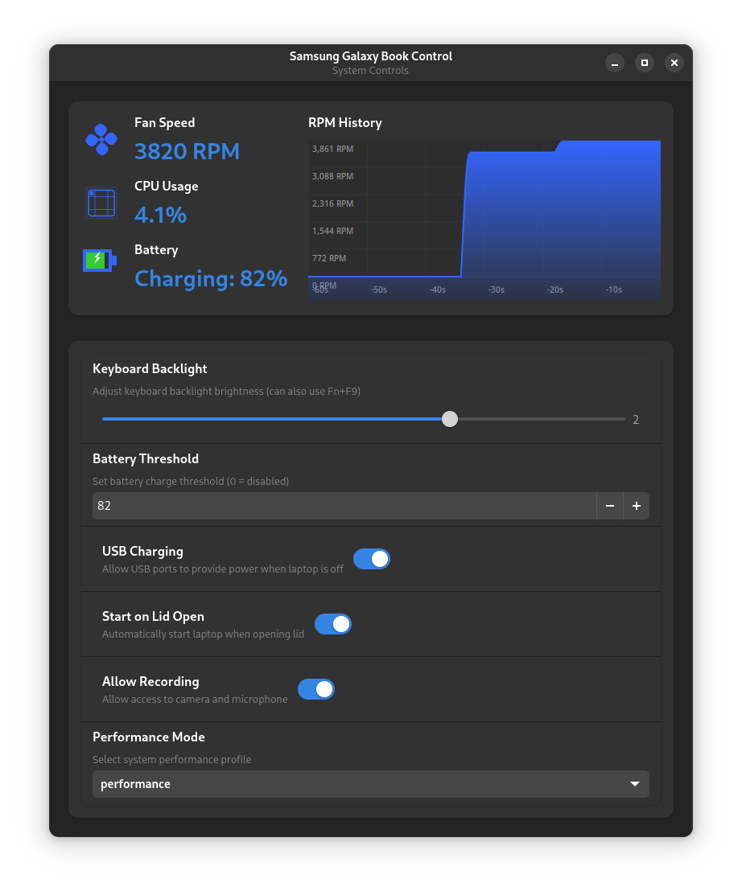

# Samsung Galaxy Book Control for Linux

> [!IMPORTANT]
> This application is currently in development and has been tested on EndeavourOS with a Samsung Galaxy Book 2 Pro 360 15.

A system settings application for Samsung Galaxy Book laptops running Linux, providing similar functionality to Samsung Settings on Windows. The application offers a modern GTK4 interface to control various laptop features and hardware settings (currently only tested on Arch-based distributions).

## Important Note About Dependencies

This application relies on the [samsung-galaxybook-extras](https://github.com/joshuagrisham/samsung-galaxybook-extras) kernel module, which is currently in development (WIP). The kernel module replicates functionality that Samsung provides in Windows through their System Event Controller and System Support Engine, including:

- ACPI driver interaction with Samsung's SCAI ACPI device
- Hardware control features (keyboard backlight, battery threshold, etc.)
- Performance mode management
- System event handling

While the kernel module is nearing readiness for mainline inclusion, please note that it's still considered a work in progress. Use the features at your own discretion.

## Features



- Modern GTK4/libadwaita interface
- Real-time system monitoring
  - [x] Fan speed with RPM history graph
  - [x] CPU usage tracking (not dependent on kernel module)
  - [x] Battery status and charging (not dependent on kernel module)
- Hardware Controls
  - [x] Keyboard backlight brightness
  - [x] Battery charge threshold
  - [ ] USB charging when laptop is off
  - [x] Lid open power control
  - [x] Camera/microphone access (Blocks/Allows usage)
  - [x] Performance mode selection

## Performance Profiles Analysis (Geekbench 6)

| Mode | Single-Core | Multi-Core | Notes |
|------|-------------|------------|--------|
| [Performance](https://browser.geekbench.com/v6/cpu/9702316) | 2372 | 10407 | Maximum performance |
| [Balanced](https://browser.geekbench.com/v6/cpu/9702378) | 2403 | 10404 | No performance loss when plugged in |
| [Quiet](https://browser.geekbench.com/v6/cpu/9702538) | 1215 | 4588 | Silent operation, ~50% performance |
| [Low-power](https://browser.geekbench.com/v6/cpu/9702639) | 1204 | 4607 | Power-efficient, similar to quiet mode |

[Performance/ Balanced vs. Quiet/ Low-power](https://browser.geekbench.com/v6/cpu/compare/9702538?baseline=9702316)

> Performance Analysis:
>
> - Balanced mode achieves similar performance to Performance mode
> - Quiet and Low-power modes trade ~50% performance for better thermals/battery
> - Perfect for switching between max performance and silent operation

## System Requirements

- Linux kernel 6.0 or newer
- Python 3.x with GTK 4 and libadwaita
- Samsung Galaxy Book kernel module (installed via the provided installer)

## Installation

### 1. Clone the Repository

```bash
# Clone with submodules
git clone https://github.com/EvickaStudio/samsung-control-linux.git
cd samsung-control-linux

# If you already cloned without --recursive, run:
git submodule update --init
```

### 2. Install Components

First, install the kernel module:

```bash
sudo ./install-extras.sh
```

#### Or follow the instructions from the [samsung-galaxybook-extras](https://github.com/joshuagrisham/samsung-galaxybook-extras) repository

Then, install the Samsung Settings application:

```bash
cd samsung-control
sudo ./install.sh
```

After installation, you'll find "Samsung Galaxy Book Control" in your applications menu.

## Additional Resources

For more information about Samsung Galaxy Book Linux compatibility:

- [samsung-galaxybook-extras](https://github.com/joshuagrisham/samsung-galaxybook-extras)
- [galaxy-book2-pro-linux](https://github.com/joshuagrisham/galaxy-book2-pro-linux) (audio support)

## License

[MIT License](LICENSE)
