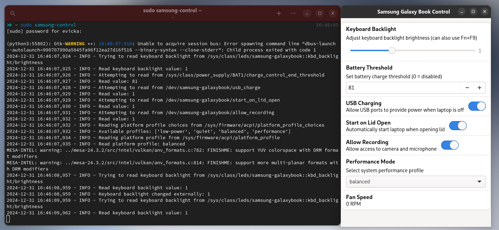

# Samsung Galaxy Book Linux Control (Arch Linux)

> [!IMPORTANT]
> This is a work in progress like the 'samsung-galaxybook-extras' module. And i only tested it on EndeavourOS with my Samsung Galaxy Book 2 Pro 360 15

A collection of scripts and tools to make Samsung Galaxy Book laptops work better with Linux (currently only Arch Linux is supported).

You can find some good information about using a Samsung Galaxy Book with Linux here:

- [samsung-galaxybook-extras](https://github.com/joshuagrisham/samsung-galaxybook-extras)
- [galaxy-book2-pro-linux](https://github.com/joshuagrisham/galaxy-book2-pro-linux) (for making the speakers work)

## Screenshots



## System Specifications

- CPU: Intel Core i7-1260P (12 Cores, 16 Threads)
- Memory: 16 GB
- Model: Samsung Galaxy Book 2 Pro 360 (950QED)
- OS: EndeavourOS (Linux 6.12.6-arch1-1)

## Performance Analysis (Geekbench 6)

| Mode | Single-Core | Multi-Core | Notes |
|------|-------------|------------|--------|
| [Performance](https://browser.geekbench.com/v6/cpu/9702316) | 2372 | 10407 | Maximum performance |
| [Balanced](https://browser.geekbench.com/v6/cpu/9702378) | 2403 | 10404 | No performance loss when plugged in |
| [Quiet](https://browser.geekbench.com/v6/cpu/9702538) | 1215 | 4588 | Silent operation, ~50% performance |
| [Low-power](https://browser.geekbench.com/v6/cpu/9702639) | 1204 | 4607 | Power-efficient, similar to quiet mode |

[Performance/ Balanced vs. Quiet/ Low-power](https://browser.geekbench.com/v6/cpu/compare/9702538?baseline=9702316)

> Interesting findings:
>
> - Balanced mode achieves similar performance to Performance mode
> - Quiet and Low-power modes trade ~50% performance for better thermals/battery
> - Perfect for switching between max performance and silent operation

## Prerequisites

- Linux kernel 6.0+
- Python 3.x with GTK 4
- Samsung Galaxy Book kernel module (install first using `install-extras.sh`)

## Installation

### Clone the Repository

```bash
# Clone with submodules
git clone https://github.com/EvickaStudio/samsung-control-linux.git
cd samsung-control-linux

# If you already cloned without --recursive, run:
git submodule update --init
```

### Install Components

1. Install kernel module:

```bash
sudo ./install-extras.sh
```

2. Install control application:

```bash
cd samsung-control
sudo ./install.sh
```

## Working Features

- Keyboard backlight control
- Fan speed reporting
- Performance mode control (with significant impact as shown above)

## License

[MIT License](LICENSE)
